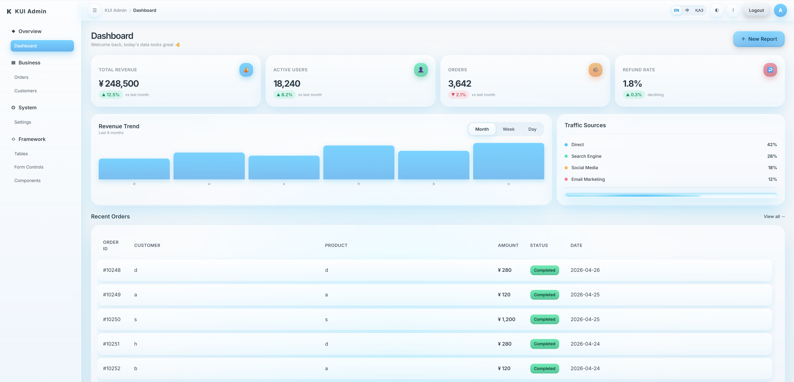
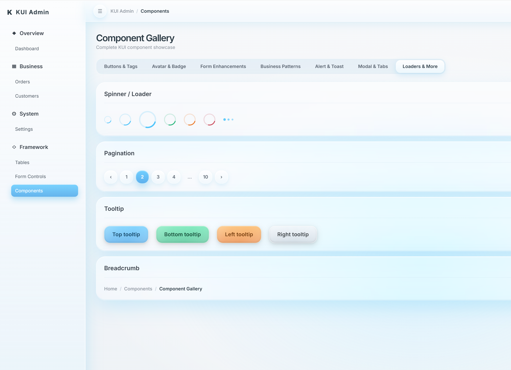
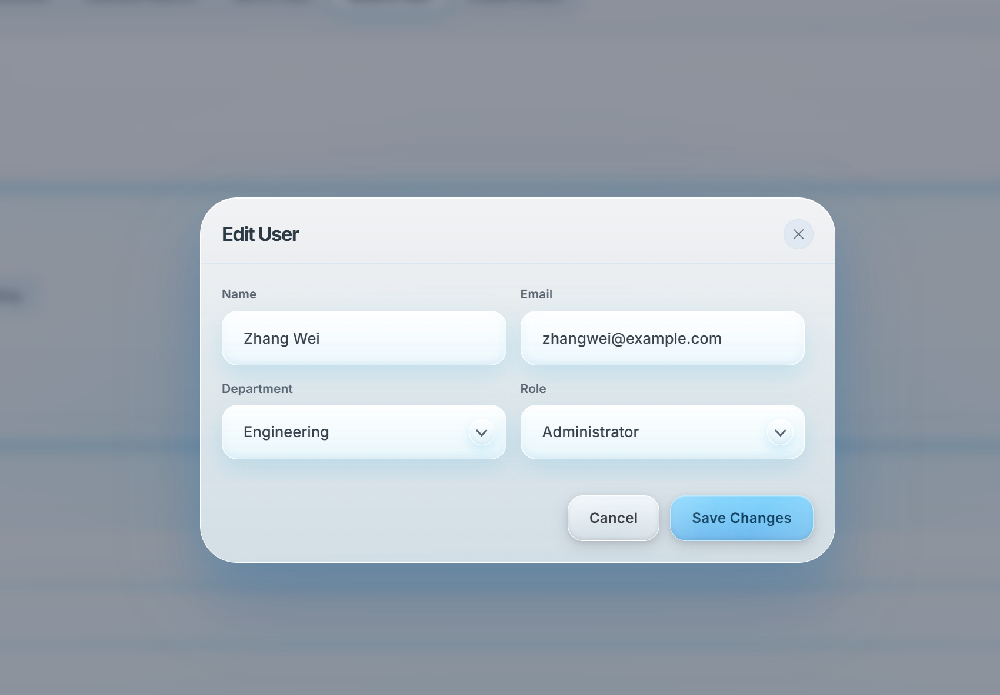

# @kokbot/kui

A glass-morphism CSS UI framework for modern admin dashboards.

## Preview







## Install

```bash
npm install @kokbot/kui
```

## Usage

```html
<link rel="stylesheet" href="node_modules/@kokbot/kui/dist/kui.css" />
```

Or in a bundler:

```js
import '@kokbot/kui/dist/kui.css'
```

## Dark Mode

```js
document.documentElement.setAttribute('data-theme', 'dark')   // dark
document.documentElement.setAttribute('data-theme', 'light')  // light
```

## Breakpoints (mobile-first)

| Prefix | Min-width |
|--------|-----------|
| `sm:`  | 640px     |
| `md:`  | 768px     |
| `lg:`  | 1024px    |
| `xl:`  | 1280px    |

Example: `<div class="k-cols-1 md:k-cols-2 lg:k-cols-4">`

## Component Classes

| Component   | Classes                                                        |
|-------------|----------------------------------------------------------------|
| Button      | `.k-btn`, `.k-btn-{blue\|green\|orange\|red\|gray\|white}`, `.k-btn-{sm\|md\|lg}` |
| Input       | `.k-input`, `.k-select-native`, `.k-select-wrap`, `.k-check-row`, `.k-checkbox` |
| Dropdown    | `.k-dropdown`, `.k-dropdown-menu`, `.k-dropdown-item`          |
| Card        | `.k-card`, `.k-card-title`, `.k-card-subtitle`                 |
| Navbar      | `.k-navbar`, `.k-navbar-brand`, `.k-navbar-actions`            |
| Stat Card   | `.k-stat`, `.k-stat-label`, `.k-stat-value`, `.k-stat-trend-{up\|down}` |
| Alert       | `.k-alert`, `.k-alert-{info\|success\|warning\|danger}`        |
| Modal       | `.k-modal-backdrop`, `.k-modal`, `.k-modal-{sm\|lg\|xl}`, `.k-modal-header`, `.k-modal-body`, `.k-modal-footer` |
| Toast       | `.k-toast-container`, `.k-toast`, `.k-toast-{info\|success\|warning\|danger}` |
| Tabs        | `.k-tabs`, `.k-tab`, `.k-tabs-line`, `.k-tab-panel`            |
| Pagination  | `.k-pagination`, `.k-page-btn`                                 |
| Avatar      | `.k-avatar`, `.k-avatar-{xs\|sm\|md\|lg\|xl}`, `.k-avatar-{blue\|green\|orange\|red\|gray}`, `.k-avatar-group` |
| Spinner     | `.k-spinner`, `.k-spinner-{sm\|md\|lg}`, `.k-dots`            |
| Accordion   | `.k-accordion`, `.k-accordion-item`                            |
| Breadcrumb  | `.k-breadcrumb`, `.k-breadcrumb-item`                          |
| Tooltip     | `[data-tooltip]`, `[data-tooltip-pos="{bottom\|left\|right}"]`|
| Chip        | `.k-chip`, `.k-chip-{blue\|green\|orange\|red\|gray}`          |
| Table       | `.k-table-wrap`, `.k-table`                                    |
| Tag         | `.k-tag`, `.k-tag-{blue\|green\|orange\|red\|gray}`            |
| Menu        | `.k-sidebar`, `.k-menu-group`, `.k-menu-item`                  |
| Progress    | `.k-progress`, `.k-progress-fill`, `.k-progress-text`          |

## Layout

```html
<div class="k-scene">
  <div class="k-layout">
    <aside class="k-sidebar"><!-- sidebar --></aside>
    <main class="k-main"><!-- content --></main>
  </div>
</div>
```

## License

MIT
